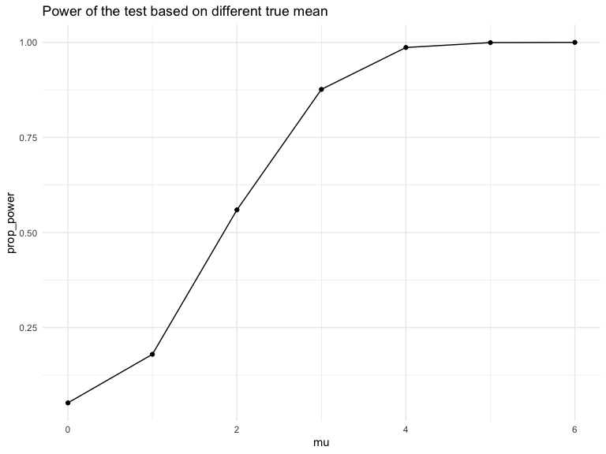
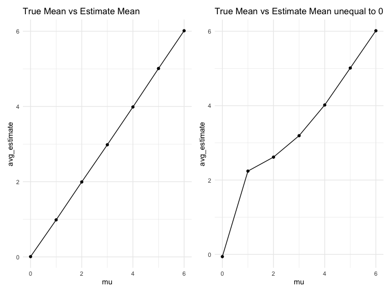
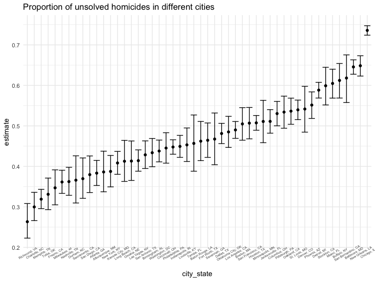

p8105_hw5_cy2752
================
Congyu Yang
2024-11-09

## Problem 1

``` r
bday_sim = function(n){
  bdays = sample(1:365,size = n,replace = T)
  duplicate = length(unique(bdays)) < n

  return(duplicate)
  }
```

``` r
sim_res <- 
  expand_grid(
    n = c(2:50),
    iter = 1:10000
  ) %>% 
  mutate(res = map_lgl(n,bday_sim)) %>% 
  group_by(n) %>% 
  summarize(prob = mean(res))

sim_res %>% 
  ggplot(aes(x = n , y = prob))+
  geom_line()+
  ggtitle("Prob of sharing bday by Group size")
```


As we can see, as the group size gets larger, the probability that at
least two people in the group will share a birthday is getting closer to
1.

## Problem 2

``` r
randomset <-  function(n = 30,mu,sigma = 5) {
  
  x = rnorm(n,mu,sigma)
  
  x %>%t.test()%>% 
    broom::tidy() %>% select(estimate,p.value) %>% 
    mutate(power = ifelse(p.value < 0.05,T,F),
           mu = mu)
}

output_0 = vector("list", 5000)

for (i in 1:5000) {
  
  output_0[[i]] = randomset(mu = 0)
  
}

output_0 %>% bind_rows()
```

    ## # A tibble: 5,000 × 4
    ##    estimate p.value power    mu
    ##       <dbl>   <dbl> <lgl> <dbl>
    ##  1    0.908  0.250  FALSE     0
    ##  2    1.87   0.0733 FALSE     0
    ##  3    1.27   0.0882 FALSE     0
    ##  4    0.261  0.813  FALSE     0
    ##  5   -0.937  0.299  FALSE     0
    ##  6   -1.21   0.131  FALSE     0
    ##  7   -0.835  0.377  FALSE     0
    ##  8    0.547  0.539  FALSE     0
    ##  9    0.485  0.683  FALSE     0
    ## 10    0.733  0.457  FALSE     0
    ## # ℹ 4,990 more rows

``` r
output = vector("list", 5000)
output_set <- vector("list",7)

for (j in 1:7) {
  for (i in 1:5000) {
  
  output[[i]] = randomset(mu = j-1)
  
  }
  output_set[[j]] <- bind_rows(output)
}
```

## Make a plot

``` r
output_set %>%
  bind_rows() %>% 
  group_by(mu) %>% 
  summarise(prop_power = mean(power)) %>% 
  ggplot(aes(x = mu, y =prop_power)) + 
  geom_point()+geom_line()+
  ggtitle("Power of the test based on different true mean")
```



As we can see, as the true value of $\mu$ going larger, the power is
approaching towards 1, since we are always doing the test comparing if
the mean is equal to 0, so as the true mean moves away from 0, the power
of the test is getting higher.

``` r
mu_compare_all <- output_set %>%
  bind_rows() %>% 
  group_by(mu) %>% 
  summarise(avg_estimate = mean(estimate)) %>% 
  ggplot(aes(x = mu, y =avg_estimate)) + 
  geom_point()+geom_line()+
  ggtitle("True Mean vs Estimate Mean")

mu_compare_only_reject <-output_set %>%
  bind_rows() %>% 
  filter(power == T) %>% 
  group_by(mu) %>% 
  summarise(avg_estimate = mean(estimate)) %>% 
  ggplot(aes(x = mu, y =avg_estimate)) + 
  geom_point()+geom_line()+
  ggtitle("True Mean vs Estimate Mean unequal to 0")

mu_compare_all + mu_compare_only_reject
```



The sample average of $\hat{\mu}$ across tests for which the null is
rejected is not equal to(larger than) the true value of $\mu$ when the
$\mu$ is smaller, but as $\mu$ getting far away from 0, they are getting
closer and equal to each other.  

This is because our test is about whether $\mu$ = 0, so when we do this
test on small $\mu$, samples $\hat{\mu}$ across tests for which the null
is rejected are far away from 0, so it will also be away from the true
value of $\mu$.  

While for larger $\mu$, almost all samples have their null hypothesis
rejected, so it is actually compare the average of all estimate of
$\hat{\mu}$ and the true value of $\mu$, accordingly, sample average of
$\hat{\mu}$ across tests for which the null is rejected is equal to the
true value of $\mu$ when $\mu$ gets far away from 0.

# Problem 3

There is one row that mistakenly write city `Tulsa` belongs to state
`AL`, which should belongs to `OK`, so we remove this row for
imprecision reason.

``` r
homicide_raw <- read_csv("data/homicide-data.csv")
```

    ## Rows: 52179 Columns: 12
    ## ── Column specification ────────────────────────────────────────────────────────
    ## Delimiter: ","
    ## chr (9): uid, victim_last, victim_first, victim_race, victim_age, victim_sex...
    ## dbl (3): reported_date, lat, lon
    ## 
    ## ℹ Use `spec()` to retrieve the full column specification for this data.
    ## ℹ Specify the column types or set `show_col_types = FALSE` to quiet this message.

This dataset about homicides in 50 large U.S. cities has 52179 rows and
12 columns. It has more than 52000 criminal homicides over the past
decade. And it includes the date of the cases，basic information about
the suspect，location of the cases and whether the arrest has been made.

``` r
homicide <- homicide_raw%>% 
  mutate(city_state = str_c(city,state,sep = ", ")) %>% 
  filter((city_state != "Tulsa, AL"))
```

``` r
total_homicide <- homicide %>% 
  group_by(city_state) %>% 
  summarize(total_cases = n()) 

unsolved_homiside <- homicide %>% 
  filter(disposition == "Closed without arrest" | disposition == "Open/No arrest") %>% 
  group_by(city_state) %>% 
  summarize(unsolved_cases = n()) 

(cases_table <- left_join(total_homicide,unsolved_homiside, by = "city_state"))
```

    ## # A tibble: 50 × 3
    ##    city_state      total_cases unsolved_cases
    ##    <chr>                 <int>          <int>
    ##  1 Albuquerque, NM         378            146
    ##  2 Atlanta, GA             973            373
    ##  3 Baltimore, MD          2827           1825
    ##  4 Baton Rouge, LA         424            196
    ##  5 Birmingham, AL          800            347
    ##  6 Boston, MA              614            310
    ##  7 Buffalo, NY             521            319
    ##  8 Charlotte, NC           687            206
    ##  9 Chicago, IL            5535           4073
    ## 10 Cincinnati, OH          694            309
    ## # ℹ 40 more rows

``` r
BalMD <- cases_table %>% 
  filter(city_state == "Baltimore, MD")

prop_test_BalMD <-
  prop.test(x = BalMD %>% pull(unsolved_cases), n = BalMD %>% pull(total_cases))

(prop_test_BalMD%>%
  broom::tidy() %>% 
  select(estimate,conf.low,conf.high) %>% 
  mutate(city = BalMD %>% select(city_state)) %>% 
  unnest() %>% select(city_state,everything()))
```

    ## # A tibble: 1 × 4
    ##   city_state    estimate conf.low conf.high
    ##   <chr>            <dbl>    <dbl>     <dbl>
    ## 1 Baltimore, MD    0.646    0.628     0.663

``` r
est_and_CI <- function(state){
  
  City <- cases_table %>% filter(city_state == state)
  
  prop_result_all <-
    prop.test(x = City %>% pull(unsolved_cases), n = City %>% pull(total_cases)) 
  
  prop_result_all%>%
  broom::tidy() %>% 
  select(estimate,conf.low,conf.high) %>% 
    mutate(city = City %>% select(city_state)) %>% 
  unnest() %>% select(city_state,everything())
  
}


(prop_test_all <- map_dfr(cases_table %>% pull(city_state), \(x) est_and_CI(x)))
```

    ## # A tibble: 50 × 4
    ##    city_state      estimate conf.low conf.high
    ##    <chr>              <dbl>    <dbl>     <dbl>
    ##  1 Albuquerque, NM    0.386    0.337     0.438
    ##  2 Atlanta, GA        0.383    0.353     0.415
    ##  3 Baltimore, MD      0.646    0.628     0.663
    ##  4 Baton Rouge, LA    0.462    0.414     0.511
    ##  5 Birmingham, AL     0.434    0.399     0.469
    ##  6 Boston, MA         0.505    0.465     0.545
    ##  7 Buffalo, NY        0.612    0.569     0.654
    ##  8 Charlotte, NC      0.300    0.266     0.336
    ##  9 Chicago, IL        0.736    0.724     0.747
    ## 10 Cincinnati, OH     0.445    0.408     0.483
    ## # ℹ 40 more rows

``` r
prop_test_all %>% 
  mutate(city_state = reorder(city_state, estimate)) %>%
  ggplot(aes(x = city_state, y = estimate)) +
  geom_errorbar(aes(ymin = conf.low, ymax = conf.high)) +
    geom_point()+
  theme(axis.text.x = element_text(size = 5,angle = 30))+
  ggtitle("Proportion of unsolved homicides in different cities")
```


