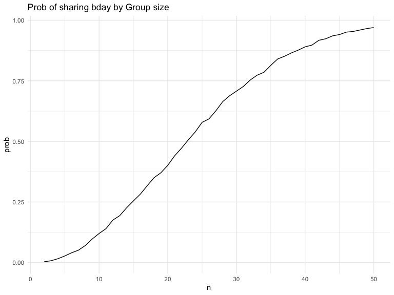

p8105_hw5_cy2752
================
Congyu Yang
2024-11-09

## Problem 1

## Problem 2

``` r
randomset <-  function(n = 30,mu,sigma = 5) {
  
  x = rnorm(n,mu,sigma)
  
  x %>%t.test()%>% 
    broom::tidy() %>% select(estimate,p.value) %>% 
    mutate(power = ifelse(p.value < 0.05,T,F),
           mu = mu)
}

output = vector("list", 5000)
output_set <- vector("list",6)

for (j in 1:6) {
  for (i in 1:5000) {
  
  output[[i]] = randomset(mu = j)
  
  }
  output_set[[j]] <- bind_rows(output)
}
```

## Make a plot

``` r
output_set %>%
  bind_rows() %>% 
  group_by(mu) %>% 
  summarise(prop_power = mean(power)) %>% 
  ggplot(aes(x = mu, y =prop_power)) + 
  geom_point()+geom_line()
```



As we can see, as the true value of $\mu$ going larger, the power is
approaching towards 1, since we are always doing the test comparing if
the mean is equal to 0, so as the true mean moves away from 0, the power
of the test is getting higher.

``` r
mu_compare_all <- output_set %>%
  bind_rows() %>% 
  group_by(mu) %>% 
  summarise(avg_estimate = mean(estimate)) %>% 
  ggplot(aes(x = mu, y =avg_estimate)) + 
  geom_point()+geom_line()+
  xlim(0,7)+ ylim(0,7)

mu_compare_only_reject <-output_set %>%
  bind_rows() %>% 
  filter(power == T) %>% 
  group_by(mu) %>% 
  summarise(avg_estimate = mean(estimate)) %>% 
  ggplot(aes(x = mu, y =avg_estimate)) + 
  geom_point()+geom_line()+
  xlim(0,7)+ ylim(0,7)

mu_compare_all + mu_compare_only_reject
```


The sample average of $\hat{\mu}$ across tests for which the null is
rejected is not equal to(larger than) the true value of $\mu$ when the
$\mu$ is smaller, but as $\mu$ getting far away from 0, they are getting
closer and equal to each other.  

This is because our test is about whether $\mu$ = 0, so when we do this
test on small $\mu$, samples $\hat{\mu}$ across tests for which the null
is rejected are far away from 0, so it will also be away from the true
value of $\mu$.  

While for larger $\mu$, almost all samples have their null hypothesis
rejected, so it is actually compare the average of all estimate of
$\hat{\mu}$ and the true value of $\mu$, accordingly, sample average of
$\hat{\mu}$ across tests for which the null is rejected is equal to the
true value of $\mu$ when $\mu$ gets far away from 0.

# Problem 3
